# 大数据

# 目录

- [此系统已实现的功能](#此系统已实现的功能)
- [经验之谈](#经验之谈)
- [需要怎么样的服务器](#需要怎么样的服务器)
- [推荐的hdfs部署方式](#推荐的hdfs部署方式)
- [hdfs_nameservice划分](#[hdfs_nameservice划分)
- [hdfs目录规范](#hdfs目录规范)
- [zookeeper集群划分](#zookeeper集群划分)
- [yarn集群划分](#yarn集群划分)
- [yarn_queue规范](#yarn_queue规范)
- [kafka集群划分](#kafka集群划分)
- [kafka规范](#kafka规范)
- [收集服务Canal/Flume集群划分](#收集服务Canal/Flume集群划分)
- [hbase集群划分](#hbase集群划分)
- [data_warehouse规范](#data_warehouse规范)
- [业务打log规范](#业务打log规范)
- [集群划分建议原则](#集群划分建议原则)
- [master节点规划](#master节点规划)
- [系统分区和挂载](#系统分区和挂载)
- [元数据在哪几个地方](#元数据在哪几个地方)
- [不错的patch](#不错的patch)
- [小文件合并](#小文件合并)
- [监控告警](#监控告警)
- [网络平面](#网络平面)
- [集群组网](#集群组网)
- [主机网卡配置](#主机网卡配置)
- [典型业务调优](#典型业务调优)
- [组件安装部署的前提](#组件安装部署的前提)
- [组件安装顺序](#组件安装顺序)
- [安装步骤](#安装步骤)
- [自动部署和扩容大数据组件](#自动部署和扩容大数据组件)
- [组件日志管理与扩容步骤](#组件日志管理与扩容步骤)
- [hdfs扩容](#hdfs扩容)
- [namenode/ldap/kdc/keytab备份与恢复](#namenode/ldap/kdc/keytab备份与恢复)
- [namenode都是standy/active怎么办](#namenode都是standy/active怎么办)
- [安全组件ranger原理/注意项/插件开启](#安全组件ranger原理/注意项/插件开启)
- [kerberos开启/jce验证keytab缺失怎么处理](#kerberos开启/jce验证keytab缺失怎么处理)
- [组件升级](#组件升级)
- [组件监控告警](#组件监控告警)
- [下载服务器的目录](#下载服务器的目录)
- [ambari_service开发步骤](#ambari_service开发步骤)
- [大数据参考资料](#大数据参考资料)


### 此系统已实现的功能
```
实现了常用的功能
主要有:
    1 支持社区版的大数据组件(tar.gz包)自动安装部署升级
    2 组件的配置都是经过生产实践考验的配置(100PB+数据 , 2k+ server, 20w+job/天)
    3 68个组件的安装部署升级
    4 组件的存活监控 和url监控
    5 组件的日志集中管理
    6 操作审计(hdfs,hive,hbase,kafka,storm等) 能知道谁在什么时候操作了什么资源
    7 权限控制(支持hdfs,hive,hbase,kafka,storm等) 支持行列级的权限管理
    8 监控告警(不止是系统的监控 还包括各种组件的jvm metrics的监控)
    9 自动扩容
```

### 经验之谈
```
    1, 业务刚起步,推荐使用google analytics(支持自定义事件和留存事件分析)/友盟/腾讯分析,不够用了再推荐使用阿里云的大数据套件或神策数据的私有化部署,最后万不得已再自己搭建，原因很简单，大数据是链路长投入大难产出的东西,第三方提供的不只是环境准备还有一整套做事方法和规范
    2, 自己搭建的情况下要对未来3年左右的机架位有规划(如果业务发展快没规划而导致有钱买机器但买不到机架位置,那么就只能搬机房了,而搬机房的拷数据的耗时是按数月计)
    3, 不管有多少集群 只有一套ldap(用户管理,可做主从同步) 一套kdc(安全票据) 一套ranger(授权和审计) 一套atlas(元数据管理 数据血缘)
    4, 尽早建立包括hdfs目录规范,yarn队列规范,数仓表规范,kafka topic命名规范
    5, 尽早建立多租户隔离机制,日志审计机制 (可用ranger解决)
    6, 尽早建立quota机制,hdfs小文件周期性合并功能
    7, 尽早建立埋点规范和埋点系统,业务打log规范
    8, 尽早建立元数据系统和数据血缘关系系统（可用开源的atlas解决）
    9，可通过kafka作为数据通道 用kafka的schema registy 把整个链路的schema管理起来
```

### 推荐的hdfs部署方式
  
  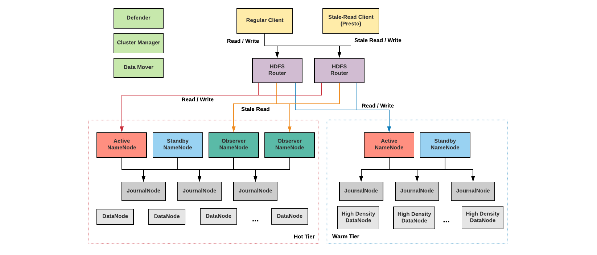  


### hdfs_nameservice划分
```
    划分多个集群，通过federation共享共通数据
    1 yarn logs,tmp 
    2 warehouse
    3 hbase
    4 streaming
```

### hdfs目录规范
```
    按业务或者组来划分目录
    以下是推荐的根目录 ，然后在此根目录的基础上按业务或组来划分
    /logs               yarn log /spark log / mr log 
    /warehouse          数仓
    /tmp                临时目录
    /hbase              hbase目录
    /user               用户目录
    /revenue            营收
    /ext                扩展 存放jar等
    /checkpoints        
```

### zookeeper集群划分
```
    划分多个集群 提高稳定性
    1 hbase/streaming/kafka
    2 warehouse/batch
    3 other
```

### yarn集群划分
```
    划分多个集群 提高稳定性，后续可通过yarn federation统一资源调度
    1, streaming
    2, batch
    3, other
```

### yarn_queue规范
```
    按 部门.业务组 划分队列
    比如 department.business
```

### kafka集群划分
```
    划分多个集群 提高稳定性
    1, 用户行为上报/nginx logs
    2, db binlog
    3, other
```

### kafka规范
```
    Kafka中Topic命名规范: department_business_feature
    partition数目为磁盘数目的4倍（也就是说每个盘上放4个partition）时候kafka的性能最优
    worker数目最好与parition数目相等

```

### 收集服务Canal/Flume集群划分
```
    离线
    实时
```

### hbase集群划分
```
    大业务单独集群
    公共/其他业务通过regionserver group隔离
```

### data_warehouse规范
```
    数仓分层和数据质量管理很重要
    数据分层不好的话 导致的直接结果是浪费计算资源和存储资源
    质量不过关的数据还不如不搞 
    ODS和DWD层尽量做到和离线链路的复用
    
    https://blog.csdn.net/zhaodedong/article/details/85293955
    https://blog.csdn.net/zhaodedong/article/details/73385647
    http://tech.weli.cn/2017/12/29/dataware-intro/
```
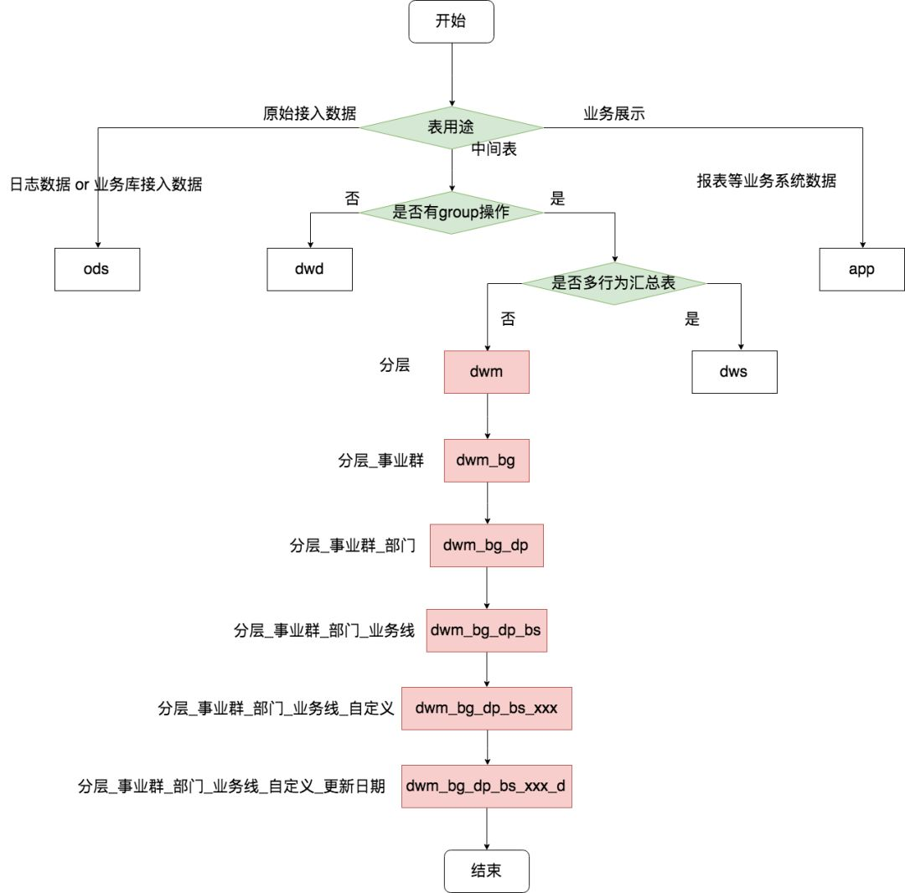
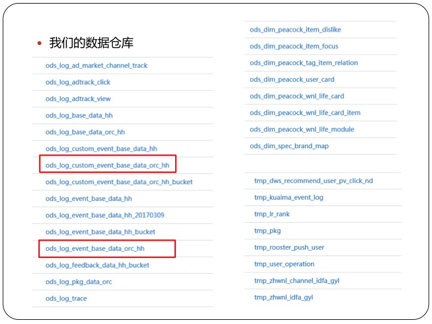

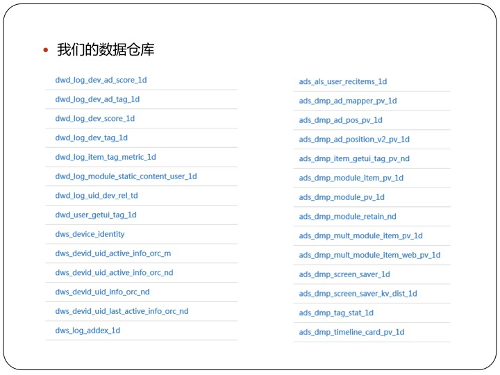
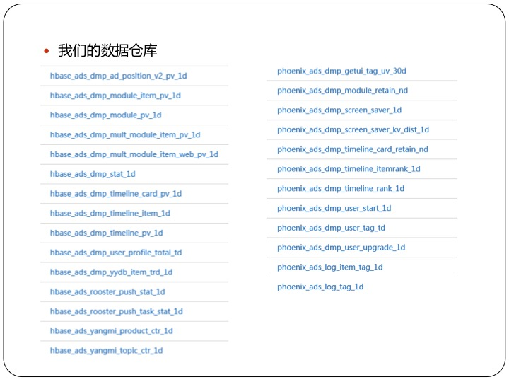
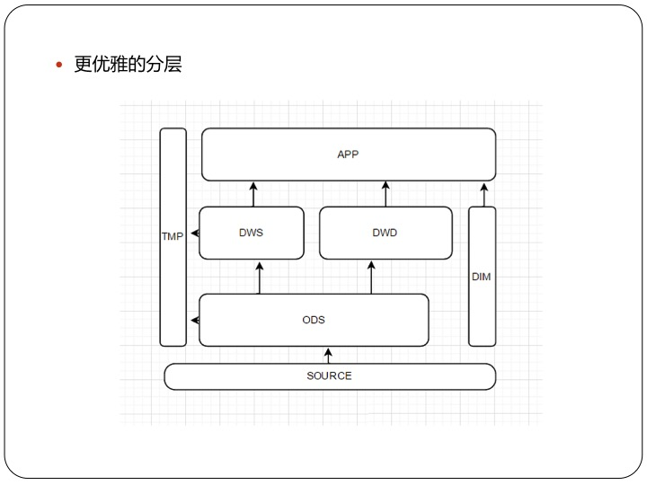
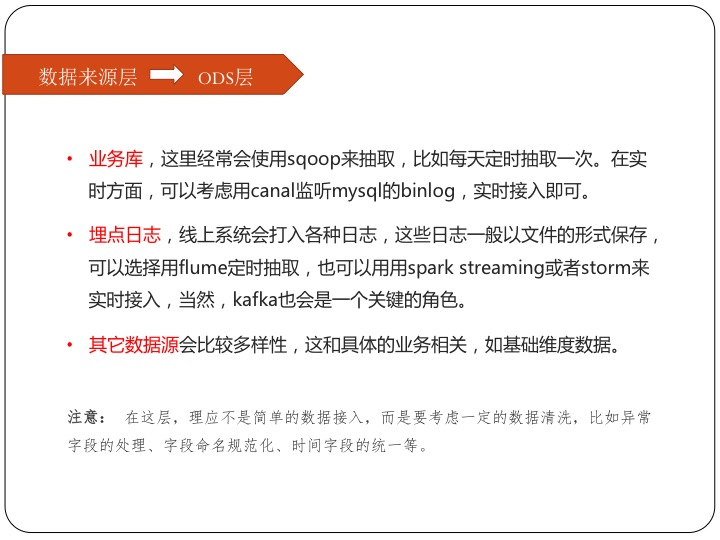
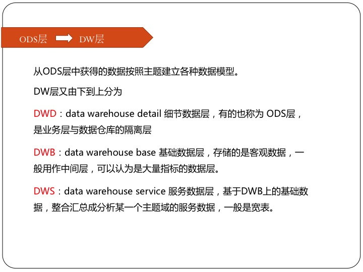
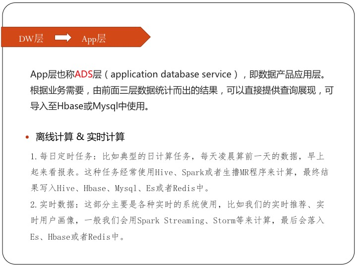
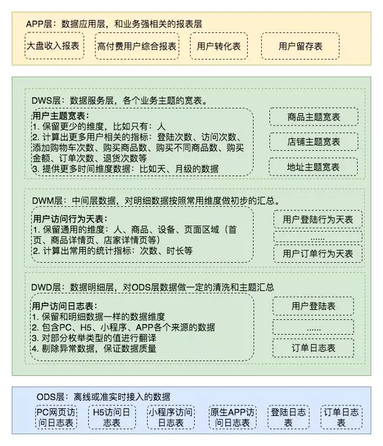

### 需要怎么样的服务器
```
    大数据组件部署的原则是混部 计算尽量靠近存储 大部分都是写入后不修改的append操作
    主要需要3类机器
    1类是master(10台左右就够)
        典型比如namenode 需要超大内存推荐512G 4个ssd硬盘做raid1备份
    1类是存储型机器，分2种 一种主力机型 一种归档机型
        主力机型（例如浪潮NF5280M5,NF5466M5/华为2298V5,5288V5） 典型如datanode/kafka 2U的机器,前置12块+后置4块盘，每盘8T，内置2块ssd盘 sata盘 不做raid 内存也尽量256G以上
        归档机型 (例如浪潮NF5486M5/华为5288V5) 4U的机器 支持106块8T盘
    1类是client型机器
        一般用来提交job的 类似gateway的角色 一般虚拟机即可
    其它关键业务服务器(hot/warn/cold中hot机型)
        (例如NF5180M5,NF8260M5/华为2288V5,2488V5)
    
    网络
        单万兆网卡即可 不做bond 
        kafka 是典型的网络瓶颈型 可配置双万兆网卡 做bond6
    
```

### 系统分区和挂载
```
    主要注意点是/var 需要单独分区 给个100G/200G 主要用来存组件日志 大数据的日志都非常多,虽会自动轮转 但也怕写爆/目录
     
    master  /var/log /data0 /data1
    data /var/log /data0 /data1 /data2 /data3 /data4 /data5 /data6 /data7 /data8 /data9 /data10 /data11
    client /var/log
    
```

### 元数据在哪几个地方
```
    大数据组件的 主要在 hive的metaserver db , zk , db , hdfs ,kafka , hbase 
    
    linux用户数据主要在ldap 安全票据在kdc
```


### 业务打log规范
```
    http://blog.jobbole.com/56574/
    https://zhuanlan.zhihu.com/p/27363484
    https://dbaplus.cn/news-134-1658-1.html
```
    
### 不错的patch
```
    https://jira.apache.org/jira/browse/YARN-4948
    https://issues.apache.org/jira/browse/HDFS-2139
    https://issues.apache.org/jira/browse/HDFS-12943
    https://issues.apache.org/jira/browse/HDFS-8966
    https://issues.apache.org/jira/browse/SPARK-23128
```
### 小文件合并
```
parquet:  hadoop jar ./parquet-tools-1.11.0.jar merge -b -l 512 /input_directory/ /output_idr/file_name
          
          合并后删除/input_directory/ 中的小文件的源文件（上述命令的输出结构中有被合并的文件列表）

```
### 监控告警
```
    2种方式:
        1,在grafana配置告警,grafana版本>5的都支持(推荐)
        2,实现 alert_dispatcher.py里自定义告警函数 。然后执行 alert_dispatcher.sh 把这个告警功能加到server中
```
### 集群划分建议原则
```
    数据(datanode)统一（可通过hdfs federation 实现namenode隔离），计算分离（通过yarn nodelabel 或 yarn federation）
    隔离实时和非实时工作负载：对实时性要求比较高的负载采用独立集群。
    根据业务对硬件资源的根本性差异（含CPU/内存/磁盘/网络），建议按照SLA等级，将不同业务拆分部署。如Mapredue通常是磁盘密集型应用，
    Spark通常是CPU/内存密集型应用，冷数据归档一般需要高密存储。混合负载的基础分析集群需要具备分级存储和标签调度能力。
```
   
### 网络平面
```
    整个系统网络划分为2个平面，即业务平面和管理平面，两个平面之间采用物理隔离的方式进行部署，保证业务、管理各自网络的安全性。
    业务平面通过业务网络接入，主要为用户和上层用户提供业务通道，对外提供数据存取、任务提交及计算的能力。
    管理平面通过运维网络接入，提供系统管理和维护功能，主要用于集群的管理，对外提供集群监控、配置、审计、用户管理等服务。
```
    
### 典型业务调优
```
    上层组件业务一般可以分为IO密集型业务，计算密集型业务，低延迟业务，高吞吐量业务。
    
    【1】低延时业务
    
        计算密集型业务，低延迟业务，这一类业务通常是对大量NameNode文件目录访问为主的。
        因此需要针对NameNode的处理能力进行调整。主要可以采取以下措施：
        1.利用federatian来增加新的NameNode的方案实现。把优先级高的业务部署在单独的NameNode，以解决资源使用问题。
        2.在业务高峰期的时，可以暂时关闭HDFS的审计日志和把运行日志级别修改为WARN级别。当业务降低的时可以在调成INFO级别。
        3.使用HDFS DataNode I/O隔离的特性，将低延迟业务的权重值增大。
        4.硬件能力提升（提升NameNode节点的CPU主频、更换DataNode的磁盘为高性能磁盘或者SSD、减少网络带宽延迟。）。
    
    【2】高吞吐量业务
        高吞吐量业务，这一类业务主要是大文件操作，对DataNode的IO需求更高。主要可以采取以下措施：
        1.扩容DataNode的节点数量，提高集群的吞吐量。
        2.扩容DataNode节点的磁盘数量，以提高单DataNode的I/O能力。
        3.更换DataNode挂载的磁盘类型，使用更高性能的磁盘或者SSD。
    
    【3】实时数据
        实时数据需要HDFS能尽快响应业务请求，对节点性能有较高的要求。为保证业务实时性,
        一般采用配置高性能的节点，并将业务隔离的方案。主要可以采取以下措施:
    
        1.采用标签存储，将存储节点按性能进行分组，让高性能的节点为其提供业务。
        2.数据节点采用SSD存储介质。
        3.采用Federation特性，隔离NameNode以及数据节点。
    
    【4】频繁访问数据
        频繁访问的数据一般指写入完成后，需要重复读取，偶尔有修改变化的数据。
    
        对于这一类数据，主要可以采取以下措施：
        1.使用Central Cache特性，将对应的文件缓存到内存。
        2.使用分级存储的特性，将对应的文件存储到SSD介质。
    
    【5】临时数据 
        临时数据一般是指在写入完成后，立即进行业务处理，处理完成后删除的数据。
        对于这一类数据，主要可以采取以下措施：
        1.使用分级存储，将数据存储到RAM盘。
        2.将副本设置为2个，减少系统存储和网络压力。
        
    【6】 归档数据
         归档数据是指数据存储到集群后，一段时间不再访问的数据：
         对于这一类数据，主要可以采取以下措施：
    
        1.使用HDFS数据生命周期管理特性（冷热数据迁移），进行数据自己迁移，
          可以将冷数据迁移到归档目录或者I/O性能较慢的存储介质上，也可以减少副本数等。
        2.存储数据时，可以采用HRM格式存储或者采用SmallFS小文件合并功能。
        3. 使用标签存储特性，将这些数据存储到高密节点上（Archive）。    
```
   
### 集群组网
  - 三层ECMP组网
    
    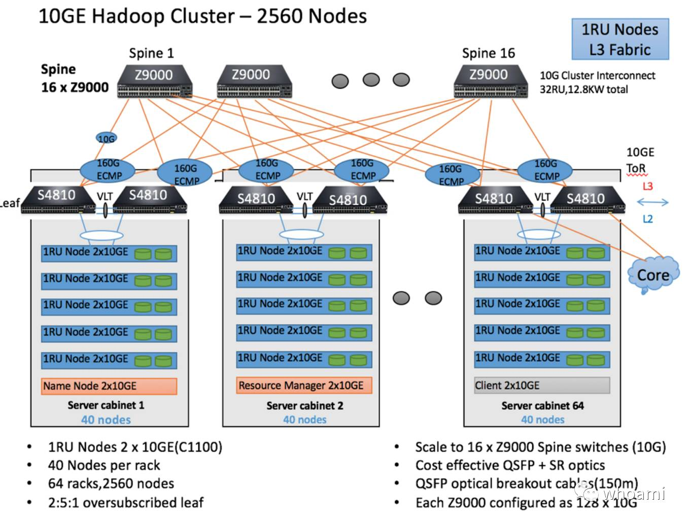
    
  - 组网特点：
  
```
    三层扁平汇聚
    ECMP实现汇聚负荷分担
    汇聚路由可线性扩展
    一个逻辑机架一个子网，机架内二层交换
```
       
  - 适用场景:
    
```
    集群节点数大于500或后续有可能扩展到大于500
    接入/汇聚交换机支持三层交换    
```
        
### 主机网卡配置
```
    每个节点的两个端口配成bond，分别接入两个接入交换机 不堆叠 无TRUNK Bond模式：mode= 6 
    采用自适应负载策略(balance-alb-rlb,Adaptive load balancing)。
    网络流量bond的两个子端口上均衡分配，汇聚流量较大
```
### master节点规划
```
    主节点相关角色放到不同的机架上，Zookeeper，JournalNode节点放到不同机架
    nodemanager 一般只跟datanode混部, datanode可跟nodemanager/regionserver/kafka brocker/storm supervisor/solr/es/presto worker等 混部
    
    master0 (JournalNode/zk/HMaster/HiveServer/MetaStore/WebHCat/spark JobHistory/ThriftServer)
    master1 (zk/HiveServer/MetaStore/WebHCat/spark JobHistory/ThriftServer)
    master2 (zk/HMaster/HiveServer/MetaStore/WebHCat/ThriftServer/EsMaster)
    master3 (zk/ResourceManager/EsMaster)
    master4 (zk/ResourceManager/EsMaster/mr JobHistoryServer)
    master5 (JournalNode/NameNode/airflow master)
    master6 (JournalNode/NameNode/airflow master)
    master7 (ldap/keberos server/Nimbus/UI)
    master8 (ldap/keberos server/Nimbus/UI)
    master9 (HiveServer/MetaStore/WebHCat/spark JobHistory/ThriftServer)
    master10 (HiveServer/MetaStore/WebHCat/spark JobHistory/ThriftServer)

```
    
    
### namenode都是standy/active怎么办
```
    Stop the ZKFC
    
    su - hdfs
    hdfs zkfc -formatZK
    
    restart ZKFC & HDFS

```

### 安装步骤
```
    1 准备数据库和java环境
    2 参考执行 https://raw.githubusercontent.com/xiaomatech/dataops/master/ambari_server_install.sh
    3 注意修改配置中的 http://assets.example.com
    4 准备assets的web服务 目录参考 assets.jpg
```

### 下载服务器的目录
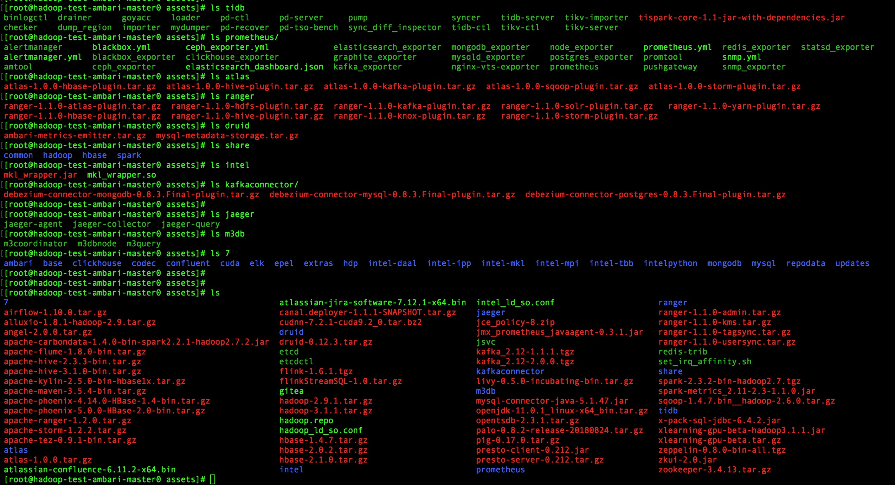


#### 组件安装部署的前提
```
### 部署环境要求
1 hostname能通过dns解析
     检验方法 dig `hostname`
2 /etc/yum.repos.d 下 yum源正常
     确保能正常安装jdk,ambari-agent,openldap-client,kerberos client
     yum install -y snappy snappy-devel lzo zlib bzip2 libzip openssl libtirpc-devel tar 
     curl jdk openldap-clients nss-pam-ldapd pam_ldap pam_krb5 authconfig krb5-libs libcgroup java-1.8.0-openjdk
3 ambari-server 有个rsa key能登录到被管理的机器
    2个可选方案:
     1,ambari-server生成的pub key分发到被管理机器
     2,使用安装系统的时候初始化好的本地账户,类似yunwei这种神账号
4 被管理机器要能ping通ambari-server,因为要注册agent和发送回心跳
5 执行 build_private_repo.sh/download_bigdata_plugin.sh/download_intel_mkl.sh 
  下载各组件到本地 创建类似mirrors.aliyun.com的下载服务器
6 能ping通cmdb(需要获取hadoop机架感知数据 如果没有这接口则没有自动机架感知功能) 
```

### 组件安装顺序
```
1 安装zk
2 安装openldap/kdc 或者 zookeeper-env填写对应的kdc_hosts,ldap_hosts
3 启动kerberos(可选)
```

### 自动部署和扩容大数据组件
```
blueprint介绍
 ambari用来自动部署大数据组件的功能
参考
 https://cwiki.apache.org/confluence/display/AMBARI/Blueprints
 https://community.hortonworks.com/articles/78969/automate-hdp-installation-using-ambari-blueprints-4.html
```

### 组件日志管理与扩容步骤
```
日志管理介绍
    大数据除了组件自身的job日志会汇总到hdfs外
    还有 ranger的审计日志,atlas的搜索功能,组件运行日志(logsearch) 存储在infra solr(solrcloud)中
对应的collect的关系
    ranger -> ranger_audits  默认保存14天
    logsearch -> hadoop_logs(组件的运行日志), audit_logs(hdfs audit log) 默认保存7天
    atlas -> edge_index,vertex_index,fulltext_index 默认保存7天
现阶段是用solrcloud分了32个shard

扩容步奏参考solr官方文档
 ```
 
### hdfs扩容
```
在ambari添加机器并安装datanode
在ambari页面 刷新namenode下的配置(做了机架感知 没刷新的时候是默认/default-rack ,datanode加不进集群)
```
 
### namenode/ldap/kdc/keytab备份与恢复
 ```
namenode 元数据(fsimage)备份与恢复
    备份在/data/backup/namenode 。备份周期：每天凌晨一点备份 全备份,保留3天 。
    备份命令/data/backup/namenode.sh
    恢复步骤 : 
        https://docs.hortonworks.com/HDPDocuments/HDP2/HDP-2.6.2/bk_hdfs-administration/content/get_ready_to_backup.html
ldap/kdc 备份与恢复
    备份:
        在每台kdc的/data/backup/ldap 备份命令/data/backup/ldap.sh  备份周期: 每小时一全备 保留3天
    恢复:
        先删除所有条目： ldapdelete -x -D "cn=manager,dc=example,dc=com" -w "密码" -r "dc=example,dc=com"
        恢复：ldapadd -x -D "cn=manager,dc=example,dc=com" -f  /data/backup/ldap/ldap_时间.ldif -w 密码

keytab 备份与恢复
    每次操作前都会备份/etc/security/keytabs下到/data/backup/keytab
    支持恢复到之前任意一次的keytab
    恢复的时候注意保留文件权限 使用 cp -rpf /data/backup/keytab/时间/keytabs/* /etc/security/keytabs/
 ```

### 安全组件ranger原理/注意项/插件开启
```
解决的问题
    hdfs,yarn,hive,spark,hbase,storm,kafka,atlas,solr等的统一权限管控
管理的数据流
    ranger-admin 负责策略存储和提供 http restful api对外提供策略查询和修改服务
    ranger-usersync 负责把用户,用户组数据从ldap中同步到ranger
    ranger-tagsync 负责把atlas上打的标签同步到ranger
插件的数据流
    1 插件启用后 会http定期(默认30秒)从ranger-admin下载策略到本地/etc/ranger
    2 通过解析策略成类似一个大hashmap 当请求过来的时候有个filter(checkPermission)做权限控制
    3 结果日志写回到solr,hdfs(新版的支持kafka没开启)
影响的组件
    主要是对应的master节点:hdfs是namenode,yarn是resourcesmanager,hive是hiveserver2,
    hbase是master,regionserver,kafka是broker,storm是nimbus
注意点
    1 hadoop-env.sh,yarn-env.sh,hive-env.sh,hbase-env.sh等要把ranger的jar加入到对应的classpath 使能找到对应的类
    2 hdfs-site.xml,yarn-site.xml,hbase-site.xml,hiveserver2.xml要加入对应的filter类

安装的时候在 ranger-env中可以修改对应的版本 ，修改后重启对应的插件就会自动升级到指定版本的插件

```

### kerberos开启/jce验证keytab缺失怎么处理
```
介绍
    kerberos是一个安全交互协议
    jce是jdk中用来加解密的jar包
    oracle jdk中没有带jce 需要自己安装
    openjdk 自带jce
查看kdc地址
    cat /etc/krb5.conf |grep 'kdc ='
查看jce状态 kerberos模式下 应该开启
    /usr/java/default/bin/java -jar /var/lib/ambari-agent/tools/jcepolicyinfo.jar -tu

keytab 备份与恢复
    每次操作前都会备份/etc/security/keytabs下到/data/backup/keytab
    支持恢复到之前任意一次的keytab
    恢复的时候注意保留文件权限 使用 cp -rpf /data/backup/keytab/时间/keytabs/* /etc/security/keytabs/
 
keytab缺失处理
    尽量不要用重新生成
```
### 组件升级
```
除了hdfs外 都支持修改配置后重启来自动升级
    1 修改对应组件的download_url
    2 重启
    3 升级完成
```

#### ambari_service开发步骤
```
   1 了解对应的service的构成,基本原则是一个component管一类守护进程,有多少类守护进程就有多少个component
   2 复制示例 services\EXAMPLE 目录
   3 修改 metainfo.xml 里的名字 ,component配置 必须全局唯一 
   4 修改kerberos的配置kerberos.json
   5 修改监控配置alerts.json(可配置成自带的功能端口监控,url监控)
   6 修改configuration目录中的配置(这个主要用来在web页面做配置管理)
   7 实现package 目录 实现install,start,stop,status,restart方法(这个目录用来下发给agent执行)
   8 把对应的目录打包拷贝到ambari-server的/var/lib/ambari-server/resources/stacks/XIAOMATECH/1.0/services
   9 重启ambari-server /etc/init.d/ambari-server restart
   10 进入http://ambari-server_ip:8080 安装部署对应的service
```

#### 大数据参考资料
```
    1 最权威的是官方文档
    2  hdp官方文档 https://docs.hortonworks.com/HDPDocuments/HDP3/HDP-3.1.0/index.html
    3 真实电商数据仓库全流程开发详解 https://chuanke.baidu.com/v1538386-116215-258987.html 
    4 青云七天学会大数据 Pro版 https://study.163.com/course/courseMain.htm?courseId=1003605105
    5 阿里大数据平台核心技术 http://www.xuetangx.com/courses/course-v1:TsinghuaX+60240202X+sp/about
    6 大数据科学与应用系列讲座 http://www.xuetangx.com/courses/course-v1:TsinghuaX+60250131X+sp/about
```
### 组件监控告警

```
自带支持5种类型监控告警
    1 port监控告警                用来监测机器上的一个端口是否可用
    2 web状态码的监控告警          用于监测一个 WEB UI（URL）地址是否可用
    3 SCRIPT                     Alert 的监测逻辑由一个自定义的 python 脚本执行
    4 metric                     用来监测 Metric 相关的配置属性
    5 aggregate                  用于收集其他某些 Alert 的状态
    
    具体参考 hdfs service下的　alerts.json的配置
```
